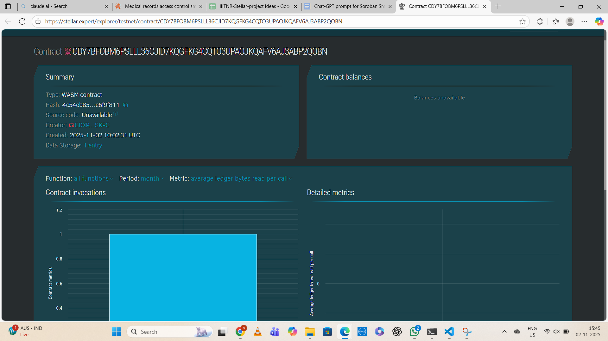

# Medical Records Access Control

## Project Title
**Medical Records Access Control on Stellar Blockchain**

## Project Description
A decentralized smart contract solution built on the Stellar blockchain using Soroban SDK that empowers patients with complete control over their medical records. The system allows patients to grant or revoke access to healthcare providers while maintaining a transparent and immutable audit trail of every access instance. This ensures privacy, security, and accountability in healthcare data management.

The smart contract implements a permission-based access control system where:
- Patients are the sole owners of their medical record access rights
- Healthcare providers must be explicitly authorized by patients
- Every access attempt is logged with timestamp and accessor details
- Access permissions can be granted or revoked at any time
- An immutable audit trail provides transparency and accountability

## Project Vision
Our vision is to revolutionize healthcare data management by:

1. **Empowering Patients**: Putting patients in complete control of their sensitive medical information
2. **Ensuring Privacy**: Implementing blockchain-based access control that prevents unauthorized data access
3. **Creating Transparency**: Maintaining an immutable audit trail that shows exactly who accessed records and when
4. **Building Trust**: Establishing a trustless system where access rights are enforced by smart contracts, not intermediaries
5. **Improving Healthcare**: Enabling seamless, secure data sharing between patients and authorized healthcare providers
6. **Compliance Ready**: Supporting healthcare regulations like HIPAA through transparent, auditable access controls

We envision a future where medical records are truly portable, secure, and patient-controlled, enabling better healthcare outcomes while maintaining the highest standards of privacy and security.

## Key Features

### 1. **Grant Access Control**
- Patients can authorize specific healthcare providers to access their medical records
- Uses blockchain authentication to verify patient identity
- Prevents duplicate authorizations
- Immutable record of all granted permissions
- **Function**: `grant_access(env, patient, provider)`

### 2. **Revoke Access Control**
- Patients can revoke access from previously authorized providers at any time
- Immediate enforcement of revocation
- Maintains historical record of authorization changes
- **Function**: `revoke_access(env, patient, provider)`

### 3. **Secure Record Access with Audit Trail**
- Healthcare providers can only access records if explicitly authorized
- Automatic verification of permissions before granting access
- Unauthorized access attempts are blocked with panic
- Every successful access creates an immutable audit log entry
- **Function**: `access_records(env, patient, provider)`

### 4. **View Audit Trail**
- Retrieve the most recent access log for a specific patient
- Returns detailed information including:
  - Provider's address (who accessed)
  - Timestamp (when it was accessed)
  - Sequential access count
- Returns `None` if no access logs exist yet
- **Function**: `view_audit_trail(env, patient)` → `Option<AccessLog>`

### 5. **Decentralized & Trustless**
- No central authority controls access permissions
- Smart contract enforcement ensures rules are followed
- Blockchain immutability prevents data manipulation
- Patient authentication via Stellar addresses

## Future Scope

### Short-term Enhancements (3-6 months)
1. **Complete Access History**
   - Store complete history of all access events using Vec<AccessLog>
   - Add pagination for viewing historical access logs
   - Filter audit logs by date range or provider

2. **Enhanced Audit Information**
   - Include the purpose/reason for access in audit logs
   - Add access type (view, edit, download)
   - Record IP addresses or device information

3. **Time-bound Permissions**
   - Allow patients to grant temporary access with automatic expiration
   - Emergency access protocols for critical care situations
   - Scheduled access windows (e.g., during appointment times)

4. **Access Request System**
   - Providers can request access, which patients can approve/deny
   - Notification mechanism for pending access requests
   - Request expiration after a certain time period

### Medium-term Enhancements (6-12 months)
5. **Granular Access Control**
   - Control access to specific sections of medical records:
     - Lab results
     - Prescriptions
     - Imaging reports
     - Visit notes
   - Different permission levels (view-only, edit, share)
   - Conditional access based on medical specialty

6. **Multi-signature Approvals**
   - Require multiple parties to approve sensitive data access
   - Guardian or family member co-approval for minors
   - Legal representative access for incapacitated patients

7. **Provider Verification System**
   - Medical license verification on-chain
   - Provider reputation scoring
   - Institution affiliation tracking

8. **Enhanced Security Features**
   - Two-factor authentication for sensitive operations
   - Biometric verification integration
   - Suspicious activity alerting

### Long-term Vision (1-2 years)
9. **AI-powered Anomaly Detection**
   - Machine learning to detect unusual access patterns
   - Automatic alerts for suspicious activities
   - Predictive analytics for security threats
   - Pattern recognition for potential data breaches

10. **Healthcare Network Integration**
    - Integration with Electronic Health Record (EHR) systems
    - Hospital Management System (HMS) bridges
    - Insurance provider integration for claims processing
    - Pharmacy integration for prescription management
    - Laboratory integration for test results

11. **Cross-chain Interoperability**
    - Integration with other blockchain networks (Ethereum, Polygon, etc.)
    - Support for decentralized identity standards (DID, Verifiable Credentials)
    - Interoperable medical data standards (HL7 FHIR)
    - Cross-border healthcare data exchange

12. **Regulatory Compliance Automation**
    - HIPAA compliance reporting and auditing
    - GDPR "right to be forgotten" implementation
    - Automated compliance checking
    - Regulatory reporting dashboard
    - Data retention policy enforcement

13. **Advanced Patient Features**
    - User-friendly web and mobile interfaces
    - Visualization of access patterns and statistics
    - Health data analytics and insights
    - Secure messaging with healthcare providers
    - Appointment scheduling integration
    - Prescription refill management

14. **Data Monetization (Optional)**
    - Allow patients to monetize anonymized data for research
    - Research institution data access marketplace
    - Patient consent management for clinical trials
    - Transparent revenue sharing models

15. **Interoperability Standards**
    - HL7 FHIR compliance for healthcare data exchange
    - IHE (Integrating the Healthcare Enterprise) profiles
    - DICOM support for medical imaging
    - CDA (Clinical Document Architecture) support

---

## Technical Architecture

### Technology Stack
- **Blockchain**: Stellar Network
- **Smart Contract Platform**: Soroban
- **Programming Language**: Rust
- **SDK**: Soroban SDK v23.1.0+
- **Storage Types**: 
  - Persistent storage for authorization data
  - Instance storage for audit logs

### Smart Contract Structure
```rust
Structs:
- AccessLog: Stores audit trail information
  - accessor: Address
  - timestamp: u64
  - access_count: u64

Enums:
- AuthorizedProviders: Maps patients to their authorized providers

Core Functions:
1. grant_access(env, patient, provider)
2. revoke_access(env, patient, provider)
3. access_records(env, patient, provider)
4. view_audit_trail(env, patient) -> Option<AccessLog>
```

### Security Features
- **Authentication**: Built-in Stellar address authentication using `require_auth()`
- **Authorization**: Permission checks before any record access
- **Audit Trail**: Immutable logging of all access events
- **Access Control**: Whitelist-based provider authorization
- **Data Integrity**: Blockchain immutability ensures tamper-proof records

---

## Getting Started

### Prerequisites
- Rust (latest stable version)
- Stellar CLI tools
- Soroban SDK

### Installation
```bash
# Clone the repository
git clone <repository-url>
cd medical-records-access-control

# Build the contract
soroban contract build

# Run tests
cargo test
```

### Deployment
```bash
# Deploy to Stellar testnet
soroban contract deploy \
  --wasm target/wasm32-unknown-unknown/release/medical_records.wasm \
  --source <your-stellar-account> \
  --network testnet
```

### Usage Examples

#### Grant Access to a Provider
```bash
soroban contract invoke \
  --id <contract-id> \
  --source <patient-account> \
  --network testnet \
  -- grant_access \
  --patient <patient-address> \
  --provider <provider-address>
```

#### Access Medical Records
```bash
soroban contract invoke \
  --id <contract-id> \
  --source <provider-account> \
  --network testnet \
  -- access_records \
  --patient <patient-address> \
  --provider <provider-address>
```

#### View Audit Trail
```bash
soroban contract invoke \
  --id <contract-id> \
  --network testnet \
  -- view_audit_trail \
  --patient <patient-address>
```

---

## Use Cases

### For Patients
- Control who can view your medical history
- Track when and by whom your records were accessed
- Instantly revoke access from previous healthcare providers
- Maintain privacy while enabling necessary medical care

### For Healthcare Providers
- Securely access authorized patient records
- Maintain compliance with access regulations
- Build trust through transparent access logging
- Streamline multi-provider care coordination

### For Healthcare Institutions
- Implement blockchain-based access control systems
- Meet regulatory compliance requirements
- Reduce data breach risks
- Enable secure inter-institutional data sharing

## Contract Details
Contract ID:CDY7BFOBM6PSLLL36CJID7KQGFKG4CQTO3UPAOJKQAFV6AJ3ABP2QOBN
